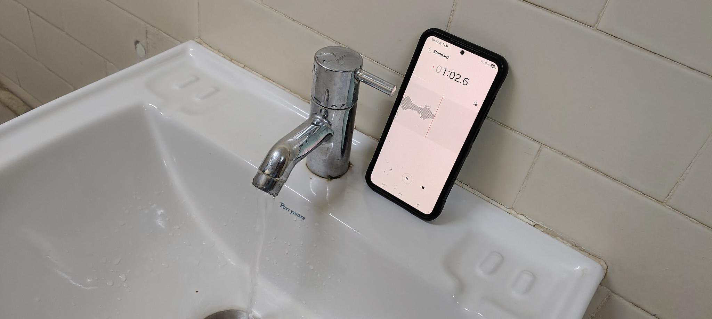
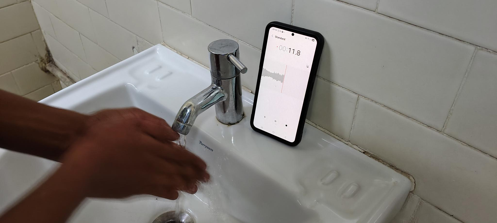
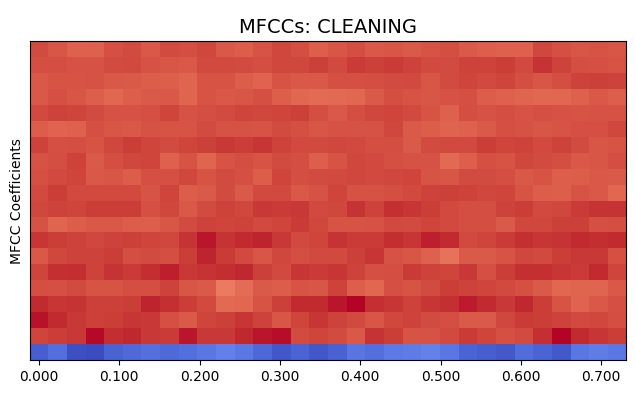
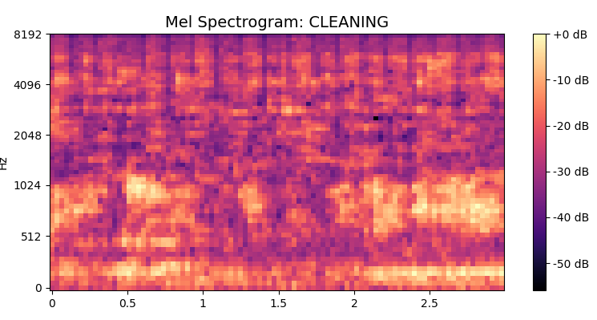
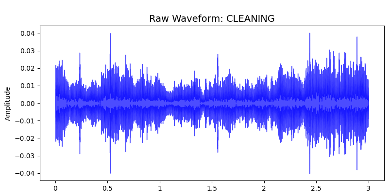
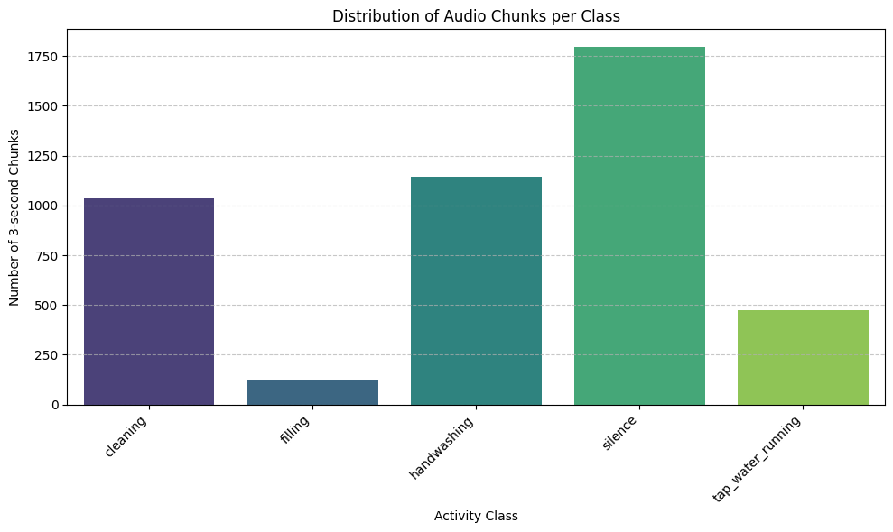
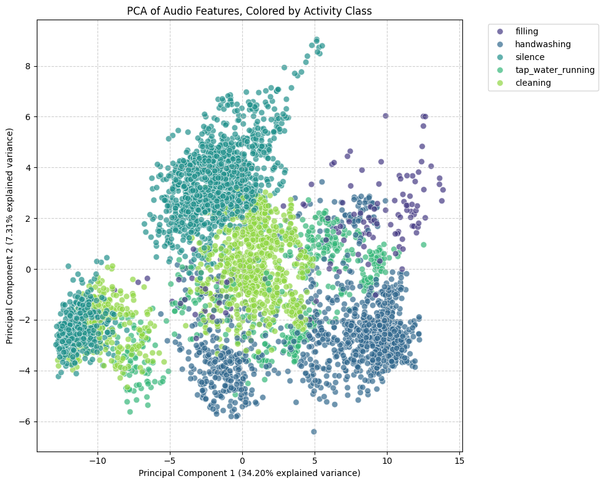
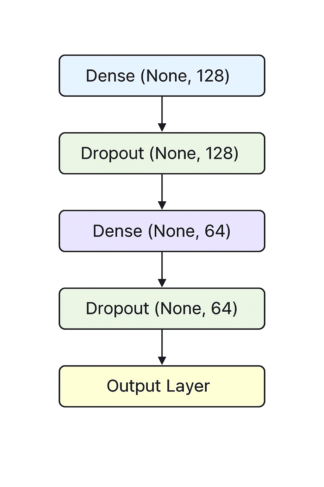
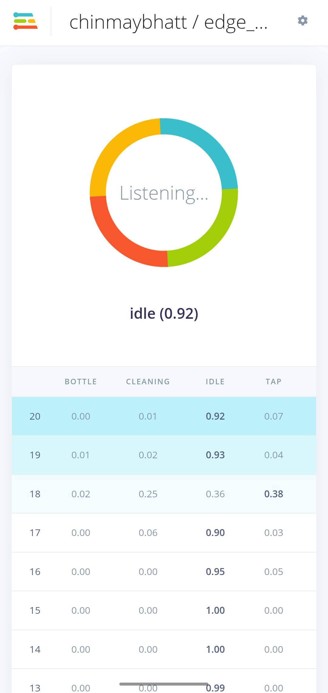
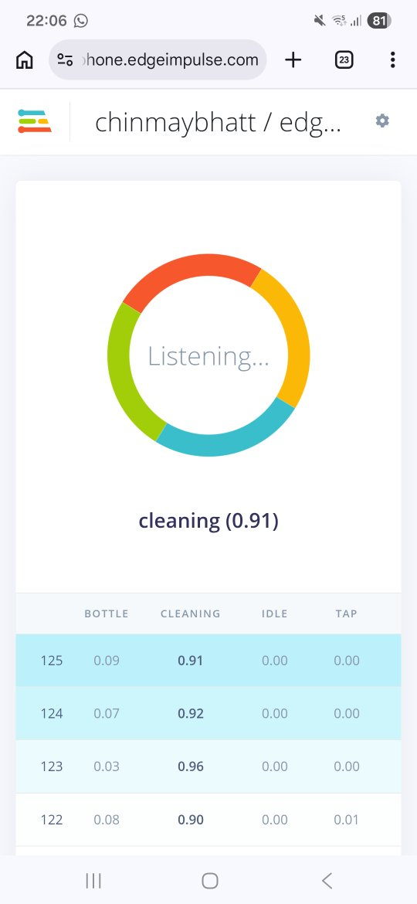

# Edge-Based-Acoustic-Event-Detection-for-Water-Activities

# Problem statement

To detect and classify water based activities based on audio. 

## Motivation and relavance.

The ultimate vision and goal was to estimate the water usage for each activity based on audio. Generally whenever one wants to estimate the water usage they use water flow meter. But this can be only be used to measure aggregate usage and doesnot distinguish how much water is being used for each activity. Moreover setting up the flowmeter is a challenging and costly affair requiring plumbing modification, maintainence and also has scalability issues. 

Although this can be used in households, to generate detailed analysis of the amount of water used in different activities provinding awareness to reduce water wastage on a more fine grain level, it has many other practical applications. For example this type of system can be used to in chemical factories to motitor the flow of chemicals, the reaction especially when dealing with corrosive chemicals where using flow meters becoming challenging. It can also be used to detect leaks, inefficiencies in water usage, abnormal flows etc in large scale organizations helping them to take appropriate measures.

We would want to develop and deploy the model on an edge device because we want the system to have high latency to be able to classify the changing activities. Moreover in certain use cases (for example if one deploys this in a washroom setting) there are privacy concerns where we do not want the audio to leave the device rather on the final statistics of the usage.

Although we were not able to achive this ultimate goal of estimating the water usage based on activity, we were only able to classify the activities based on audio (which in itself turned out to be a tricy task).

# Proposed Solution

We propose the following solution. The system consists of a edge device (either an PCB with an audio module or a mobile phone) that both records the audio and does the necessary processing to classify the audio. Another device that collects the classification scores and other meta data from this edge device and provides statistics, insights and suggestions into water usage based on the data. (We were not able to finish the second part). 

`Record Audio (Edge Device)` -> `Classification (Edge Device)` -> `Statistics and Insights (Server/PC)`

# Hardware and Software Setup

This section describes the hardware components and software tools used in the Water Detection System.

##  Hardware Requirements

| **Component** | **Specifications / Purpose** |
|--------------|------------------------------|
| **Arduino Nicla Vision** | 2 MP camera, 6‑axis motion sensor, microphone, distance sensor, **STM32H747AII6 dual‑core processor** (Cortex‑M7 & Cortex‑M4) |
| **Arduino Nicla Voice** | **nRF52832 SoC**, 64 MHz Arm Cortex‑M4F, 64 KB SRAM, 512 KB Flash, ANNA‑B112 Bluetooth module, 12‑bit ADC, SPI & I²C support |
| **Mobile Phone (Moto G57 Power)** | Android smartphone used for running the Flutter app, audio recording, and displaying real‑time predictions |
| **PC / Laptop** | Used for Edge Impulse project development, model training, firmware building, and device flashing |
| **USB Cable** | Used for data transfer, power supply, and device programming/debugging |
| **Power Bank (Ubon 10000 mAh)** | Portable power supply for standalone operation of embedded hardware |                                                                               |

---

##  Software Used

| Software                          | Purpose                                                    |
| --------------------------------- | ---------------------------------------------------------- |
| TensorFlow 2.x                    | Model development, training, and quantization              |
| Jupyter Notebook                  | Model training, evaluation, and TFLite conversion          |
| Edge Impulse Studio               | Model packaging and deployment to Arduino                  |
| OpenMV                            | Device interaction and testing                             |
| Arduino IDE                       | Firmware integration and flashing                          |
| Flutter                           | Android application development                            |
| Google Firebase                   | Real-time data storage and statistics                      |

#  Data Collection

This was the most crucial step since we had no available datasets to work with. We created our own dataset and we had to go through multiple iterations to do it.

  

 

  

## Methodology of data collection

Primarily we first collected two sets of data that was finally used in the development and deployment of the model.

- **First (Fixed Environment: Single washroom)** We collected data of three activities `HandWashing` `Free Running Tap` `Idle (No activity)`. All the three activities were done in a single washroom, in a single wash basin.
- The audio was recorded using a mobile phone at 48kHz. The mobile phone was placed at a single location.
- For each activity we recorded a continuous strech of about 10 - 15 mins of data.
- From the above collected data we also generated a new data of 16Hz using audacity incase we want to specifically train for the aurdirino devices.

- **Second (Variable : Multiple washrooms)** We collected data of 5 avtivities `Handwashing` `Free Running Tap` `Idle (No activity)` `Filling the bottle` `Washing Utensil`. Here we have increased the number of activities.
- The audio was recorded using a mobile phone at 44.1 kHz. We introduced variability of environment, distace of the recording device (phone).
- We collected data across 10 different washrooms. We varied the distance of the recording device by few 10 cm to around 50 cm. We also varied the orientation of the recording device
- For each activity we collected data for about 2-3 mins. Only exception being Filling the bottle, since each bottle filled up within less the 15 seconds.

**All the development and deployment given here is done in the variable environment.**

## Challenges and other failed attempts

During the course of data collection we encountered several challenges, some of them which we discuss below.

- Firstly our initial attempt was to record multiple activities in a single strech, and the annotate the time stamps of the activities to avoid renaming and tranferring large number of files. But the first iteration proved that annotation took too much time. We then moved on to record a one activity per file.

- Secondly while collecting data on a single large file (as we did for data in a single washroom) we realized that doing a few activities like washing hands (leading to pruney hands) and washing utensils caused discomfort. So we moved on to collect short segments of data (2-3mins)

- Since the data was collected in washrooms, privacy was a concern. We ensured that no one was using the washroom when the data was being collected mostly collecting the data at night times.

- While collecting data we were faced with the dillema of water wastage. So we tried to minimize the water wastage (by bare minimum) by using water filled in bottles to water the plants nearby.

# Data Processing and Feature Extraction

## Feature Extraction

To convert raw audio signals into meaningful representations, feature extraction techniques were applied. The primary feature used is **Mel-Frequency Cepstral Coefficients (MFCCs)**, which capture the spectral characteristics of sound based on human auditory perception. MFCCs are effective in representing timbre and frequency patterns of water sounds.

In addition to MFCCs, the following features were extracted:

**Mel Spectogram**
  To capture the temporal at different frequencies.

**Delta and Delta-Delta Coefficients**
  Capture temporal variations and changes in sound over time

**Zero Crossing Rate (ZCR)**
  Measures signal noisiness and abrupt changes

**Spectral Centroid**
  Represents the brightness of sound

**Spectral Contrast**
  Captures variations across frequency bands

Statistical measures such as **mean, standard deviation, and maximum values** were computed for each feature. All features were combined into a single feature vector for model input .

<!-- 3 photos mfcc1, spec, waveform -->

  

  

  

## Data Augmentation

To improve model robustness and handle variability in real-world conditions, data augmentation techniques were applied:

* Addition of random noise
* Random amplitude scaling
* Frequency masking on MFCC features

These techniques increase dataset diversity and help reduce overfitting, improving generalization .

## Feature Visualization and Analysis

Exploratory Data Analysis (EDA) was performed to evaluate the effectiveness of the extracted features.

###  Class Distribution

The dataset shows **class imbalance**. For example the bottle filling activity has very less data and this is due to the fact that filling the entire bottle takes only 10 seconds and we had to do this activity multiple times even after this we felt short of data. This imbalance can bias model so we use techniques like augmentation and balancing to overcome this.

  

### PCA-Based Visualization

Since the feature space is high-dimensional, **Principal Component Analysis (PCA)** was used to reduce it to two dimensions for visualization.

* Clearly activities like handwashing, silence, and cleaning form a little distinctive clusters that can be used to learn decision boundaries.
* Interesting thing to note is that the tap water overlaps with all of the activities. This can be expected because the tap is always running with all other activities except silence/idle with which the tap doesn't overlap.
* Clearly the PCA also suggests class imbalance.

  

---

# Model Development

## Iteration 1: The Background Noise Problem
**The Challenge:** Initially, we recorded data as continuous 2 to 3-minute audio files for each activity. When we tested the first model, it failed on new data. The model was memorizing the background room noise rather than the actual water sounds.

**The Change:** We split the audio into smaller chunks and balanced the training data. We capped every class to the exact same number of audio chunks to prevent the model from guessing based on class frequency.

**The Result:** The model stopped relying on background noise and began learning the acoustic patterns of the target sounds.

---

## Iteration 2: The Importance of Feature Engineering
**The Challenge:** The mobile phone records audio at 44.1 kHz, meaning a 3-second clip contains over 132,000 raw data points. Feeding this raw data directly into a model requires significant memory and makes pattern recognition difficult.

**The Change:** We shifted our focus to feature engineering. Instead of raw audio waves, we used Fast Fourier Transforms to convert the sound into frequency heatmaps (Mel Spectrograms) and compressed acoustic features (MFCCs).

**The Result:** The data became cleaner and more compressed. The model received a structured map of the audio frequencies rather than a dense raw wave.

---

## Iteration 3: Testing the Fully Connected Neural Network (FCNN)
**The Challenge:** Using our engineered features, we initially built a Fully Connected Neural Network (FCNN). However, FCNNs look at fixed temporal positions. If a splash occurred at second 1 during training, the network struggled to recognize a splash at second 2 during testing. Additionally, connecting all neurons resulted in a large number of parameters.

**The Change:** We realized a time-independent architecture was necessary for this audio classification task to handle variable event timings.

**The Result:** We moved away from the FCNN to find a model capable of scanning audio sequentially.

  

---

## Iteration 4: Switching to a 2D CNN
**The Challenge:** We needed to resolve the rigid timing issue of the FCNN while keeping the model size small enough for a phone.

**The Change:** We adopted a 1D Convolutional Neural Network (1D CNN). Instead of analyzing the entire audio clip at once, a 1D CNN uses a sliding window to scan the features over time.

**The Result:** The 1D CNN was able to detect sounds regardless of when they occurred in the clip. This change also reduced the overall model size, making it practical for mobile Edge AI.

---

## Iteration 5: Edge Impulse

### 1. Impulse Configuration

The impulse defines how raw audio is segmented into samples.

- **Window size**: 2000 ms  
- **Window stride**: 1000 ms  
- **Input type**: Time-series audio  

This step converts continuous audio into fixed-length examples suitable for feature extraction.

---

### 2. DSP Block: MFCC (Feature Extraction)

Mel Frequency Cepstral Coefficients (MFCCs) are used to represent audio features.

#### MFCC Parameters
- Number of MFCC coefficients: 13  
- Number of mel filter banks: 32  
- Frame length: 25 ms  
- Frame stride: 20 ms  
- FFT length: 2048  
- Low frequency bound: 80 Hz  
- High frequency bound: Nyquist  
- Pre-emphasis coefficient: 0.98  

Each audio window is transformed into a 2D MFCC feature map for learning.

---

### 3. Learning Block: Audio Classifier

A **2D Convolutional Neural Network (CNN)** is used for classification.

#### Model Architecture
- Reshape MFCC features into a 2D format
- Convolutional layers:
  - Conv2D (8 filters, 3×3 kernel, ReLU)
  - MaxPooling + Dropout
  - Conv2D (16 filters, 3×3 kernel, ReLU)
  - MaxPooling + Dropout
- Fully connected output layer with **softmax activation** (5 classes)

  

#### Training Details
- Loss function: Categorical Cross-Entropy  
- Optimizer: Adam  
- Training includes internal shuffling and regularization  
- Optional audio data augmentation (SpecAugment)

---

### 4. Model Evaluation

Edge Impulse automatically evaluates the model using:
- Test accuracy
- Confusion matrix
- Per-class performance metrics

This allows validation of model performance across all activity classes.

#### Testing metrics:

  

#### Confusion Matrix:

  

---

### **Deployment on Mobile Phone**

The trained model was deployed on a mobile application to enable real-time detection of water-based activities using acoustic signals. The application records audio using the smartphone microphone, processes the input, and predicts activities such as handwashing, bottle filling, idle and utensils cleaning. The results are displayed within the app, providing real-time insights into user activity.

The system relied on a server-based approach, where recorded audio was sent to a backend for processing and prediction. However, this introduced latency and dependency on internet connectivity. To address this limitation, an alternative version of the application was developed to perform on-device inference, allowing direct processing on the mobile device without requiring server communication, but this on-device application still has bugs that need to be addressed.

Users can download and run the application by accessing the **`water_app`** folder from the project GitHub repository. The app can be installed on a mobile device by enabling developer mode and USB debugging, connecting the phone to a laptop, and running the application using Flutter. Detailed setup and usage instructions are provided in the **`README.md`** file included in the repository.

## Deployment on Arduino Device

The trained model from the Edge impulse studio was deployed on Nicla Vision. To do this we built the model using the Arduino librory on Edge Impulse and then compiling and flashing the obtaing files using the Arduino IDE. The IDE was use to provide real time inference, where it was connected to a PC using a USB cable.

Although we tried to deploy the model on Nicla Voice, we faced several challenges that could not be resolved and we ultimately changed the device to Nicla Vision.

## Deployment using edge impulse

The trained 2D CNN model can be deployed directly from Edge Impulse to:
- Android Phone: Using the edge impulse android library.
- Edge Devices: Using the edge impulse arduino based library and eon compiler.
- On phones we can directly deploy the model by scanning this QR code.

  

  
  

#### Comparison of Quantized and Unquantized Models Deployment

  

---

---

### **Challenges**

* Limited experience in mobile application development.
* Dependency on server-based inference leading to latency.
* Difficulty in implementing on-device model inference.
* Runtime errors and instability in the mobile application.
* Challenges in achieving consistent real-time predictions.
 During live testing, the Flutter mobile app failed to produce accurate predictions. The model was trained to expect engineered features (Spectrograms), but the app was sending raw 44.1 kHz audio, as replicating the feature engineering math natively in Flutter proved difficult.

**The Change:** We embedded the feature engineering directly inside the TensorFlow model by adding a custom preprocessing layer at the front of the network.

**The Result:** The mobile app now records 13 second chunks of raw audio and passes it directly to the model. The model handles its own feature extraction internally, which resolved the mismatch and stabilized the live predictions.

## Deployment on Aurdirino device.

<!--  -->

